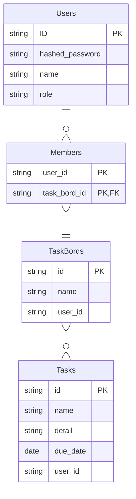
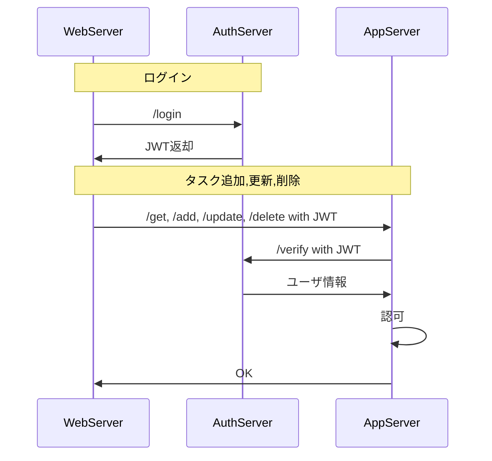

# task-manage
## 概要
Javaベースのタスク管理アプリケーション

## 目的
1. Java(SpringFramework)学習
2. gRPC学習

## 機能一覧
1. ユーザ登録
   - 画面からログインID、パスワード、権限を登録する
2. ログイン、ログアウト
   - 登録したログインID,パスワードでログインする
   - ログアウトする
3. ユーザ認証・認可
   - 登録したユーザ情報をもとに、各操作の権限チェックを行う
4. タスクの追加
   - タスクを追加する
5. タスクの更新
   - すでに登録されたタスクを更新する
6. タスクの削除
   - すでに登録されたタスクを削除する

## 機能詳細  
- ユーザ認証・認可  
  - すべてのユーザーはタスクボードを作成できる
  - すべてのユーザーは自らが作成したタスクボードの更新・削除ができる
  - すべてのユーザーは自らが作成したタスクボードにメンバーを追加できる
  - タスクボードのメンバーはボードにタスクを追加・更新・削除できる
  - システム管理者はすべてのボードを更新・削除できる

## ER図

## シーケンス図

## 利用技術
### 言語・フレームワーク
- Java：TODOバージョン記載  
  - Spring：TODOバージョン記載

### ミドルウェア
TODO必要があれば記載

### その他
- gRPC

## ディレクトリ構成
TODO
ディレクトリ構成ができてから転記

## 動作確認手順
TODO
動作確認手順が確立したら記載
